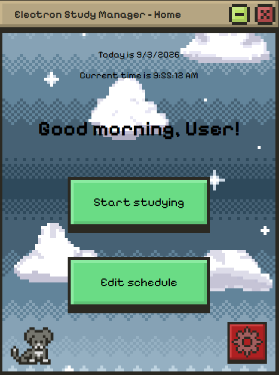
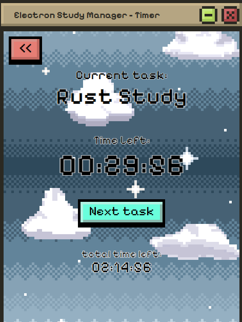
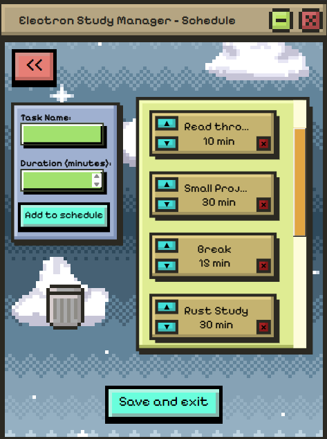
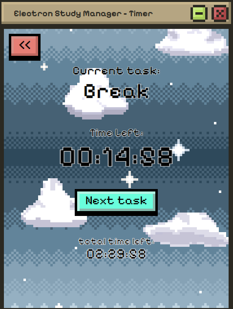

# Electron Study Manager

A simple cross-platform study manager and timer. Manage your day with style.

## Manage your study
Electron Study Manager allows users to create and customise a daily study schedule. 
Create a set of tasks and set times for each. The manager will send you notifications when each task is complete.

## Create a daily study schedule
Create, delete, and reorder tasks. Set a time for each task. Tasks are completed top to bottom

## Set breaks and intervals
With this application, you can set breaks and adjust your schedule as needed. 
Try something that works for you.

## Style
Human made pixel art. A charming style you can add to your schedule
   

### - Day cycle
Basic implementation of a day/night cycle for the backgrounds
  

## Notes
This is a very basic and likely broken and unfinished implementation. Be on the lookout for future updates.